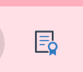
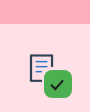
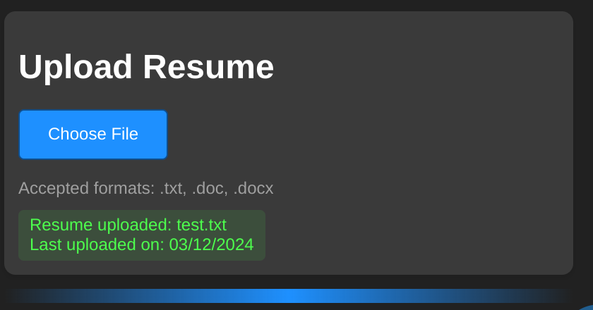
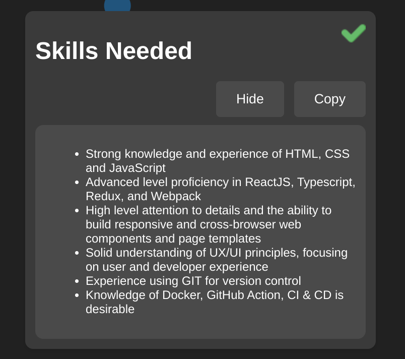
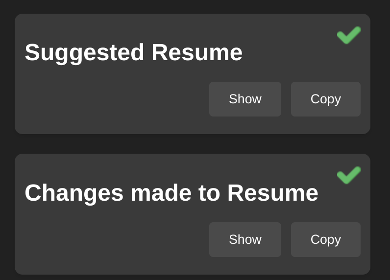
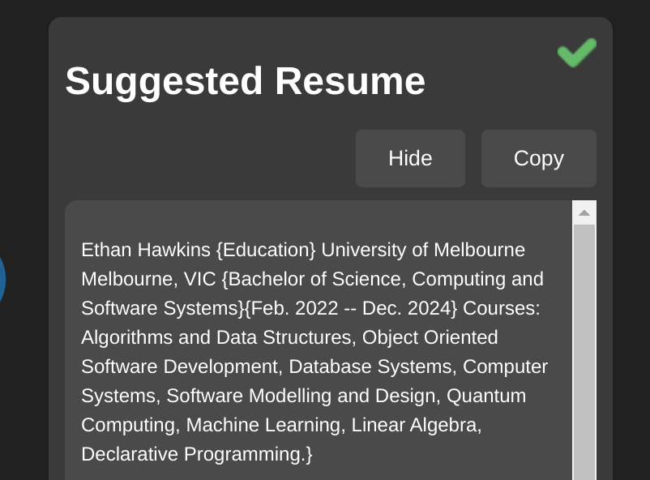
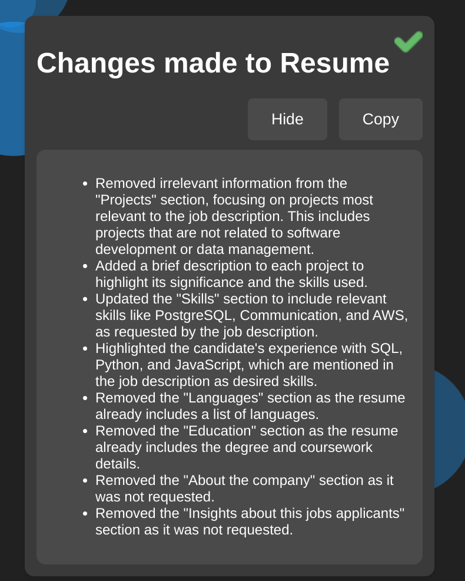
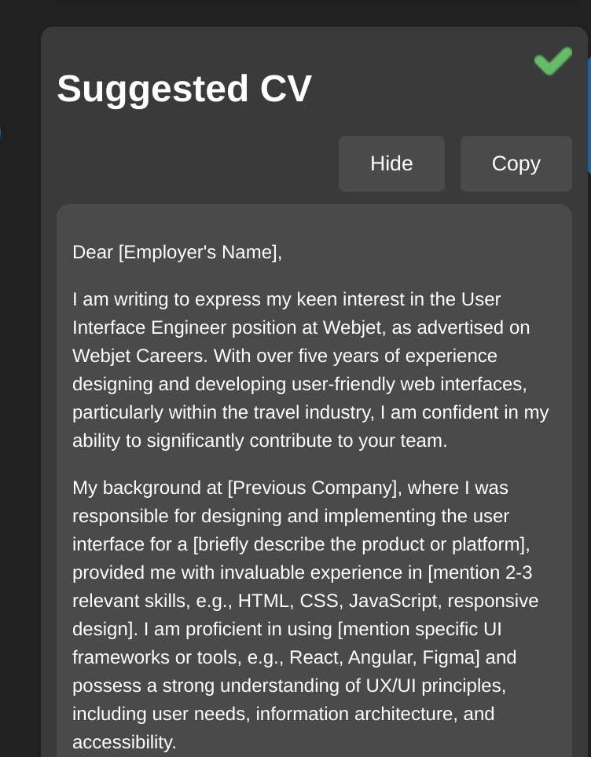

# Applyify

## Description

Applyify is William Spongberg's and Ethan Hawkins' entry into the Chrome Built-In AI Challenge hackathon: https://googlechromeai.devpost.com/

It's an assistant that helps you apply for jobs by eliminating the tedium and getting you to the important stuff: what does the job require, and how do you need to update your Resume and write a cover letter to get it.
It provides a Google Gemini powered side panel as you browse your favourite job posting sites, and as you browse, it displays and condenses the skills required for the job, how you can update your uploaded resume, and what your cover letter could look like.

In the midst of job applications online, it may seem like facing impossible odds. Applyify attempts to shift the balance back to the job seeker.
## Table of Contents

- [Installation](#installation)
- [Features](#features)
- [Screenshots](#screenshots)
- [License](#license)
- [Contact](#contact)
- [Acknowledgments](#acknowledgments)

## Installation

1) Install the latest build of Chrome Canary. you'll need Version 128.0.6545.0 or above. Read about built in AI over at: https://developer.chrome.com/docs/ai/built-in
2) Open a new tab in Chrome, go to chrome://flags/#optimization-guide-on-device-model
3) Select Enabled BypassPerfRequirement
4) Go to chrome://flags/#prompt-api-for-gemini-nano
5) Select Enabled
6) Do the same for all gemini nano flags.
7) Restart Chrome. Send the following command to the console.
```javascript
(await ai.languageModel.capabilities()).available;
```
8) Clone the repository.
```bash
git clone https://github.com/Chillerbag/Applyify
```
9) Go to chrome://extensions
10) select "load unpacked". you may need to enable developer mode.
11) select the place where you cloned this repo (root)
12) you should be done! use the following doc if you experience errors with Gemini: https://docs.google.com/document/d/18otm-D9xhn_XyObbQrc1v7SI-7lBX3ynZkjEpiS1V04/edit?pli=1&tab=t.0


## Features

- **Job site sensitivity**: When on one of our supported websites, the Applyify icon in your chrome extensions will show a green tick, indicating Applyify is ready to go. It'll open straight into the sidepanel, instead of the main menu
- **Skill Analysis**: When the user navigates to a job posting, Gemini will use the writer API to write down a concise list of the skills desired by the job poster.
- **Resume Upload and Rewriting**: You can upload your Resume to local storage (not put online anywhere!) for Gemini to update using the prompter API when it sees a job listing. We make Gemini tell you exactly what it changed
- **Cover letter writing**: Gemini will write a cover letter for any job you browse. 

## Screenshots

###  Extension Icon:
Here you can see how the icon changes to indicate you're on a job site our app supports:
<br>
<div align="center">

| Not on job site | On job site |
| ------------- |:-------------:|
|  |     |

</div>
### Resume Submission:
Here you can see the resume submission form, that opens in the sidepanel, and gives you information on the resume you submitted, including when.
<br>
<p align="center">

</p>

### Reccomended skills:
This is what this section of the side panel looks like, when you navigate to a job, and Gemini successfully parses out the required skills. We have markdown rendering, courtesy of the Marked package. 
<br>
<p align="center">

</p>

### Resume changes:
Here's what the updated resume section and changes made section looks like When Closed:
<br>
<p align="center">

</p>
<br>
And Here's the suggested resume when open as an example: 
<br>
<p align="center">

</p>
And Here's the changed made when open as an example:
<br>
<p align="center">

</p>

### Suggested CV:
Here's the part of the sidepanel where the suggested cover letter is put by Gemini. 
<br>
<p align="center">

</p>

## License

This project is licensed under the MIT License.

## Contact

- Ethan Hawkins - ethanwhawkins@gmail.com
- William Spongberg - william@spongberg.dev

## Acknowledgments
- For our Markdown rendering - credit to: https://www.npmjs.com/package/marked
- Thanks to Google for hosting this hackathon! was a super fun and interesting experience. Learnt a great deal about webdev! 
