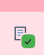
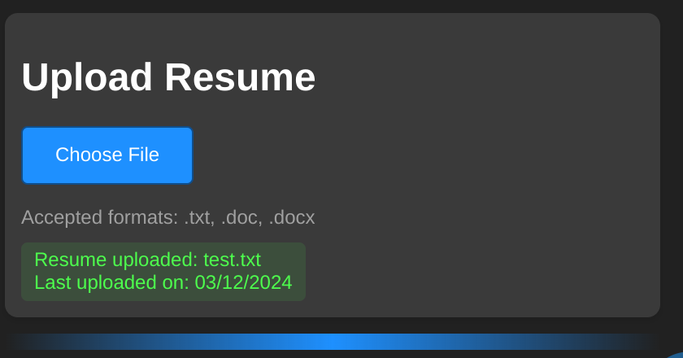
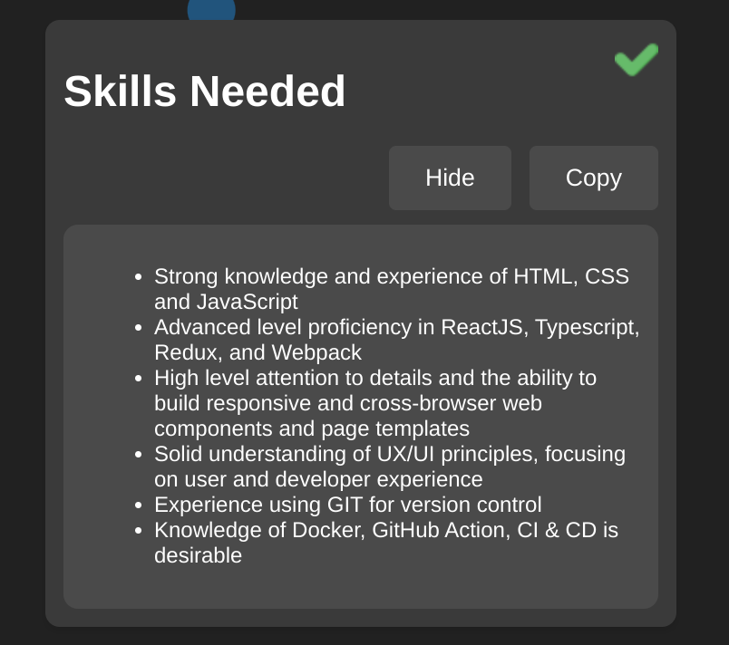
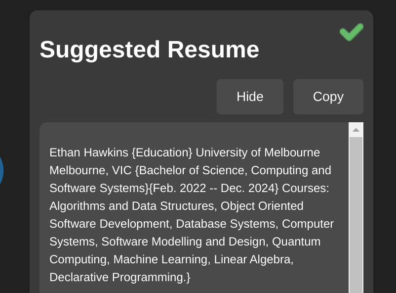
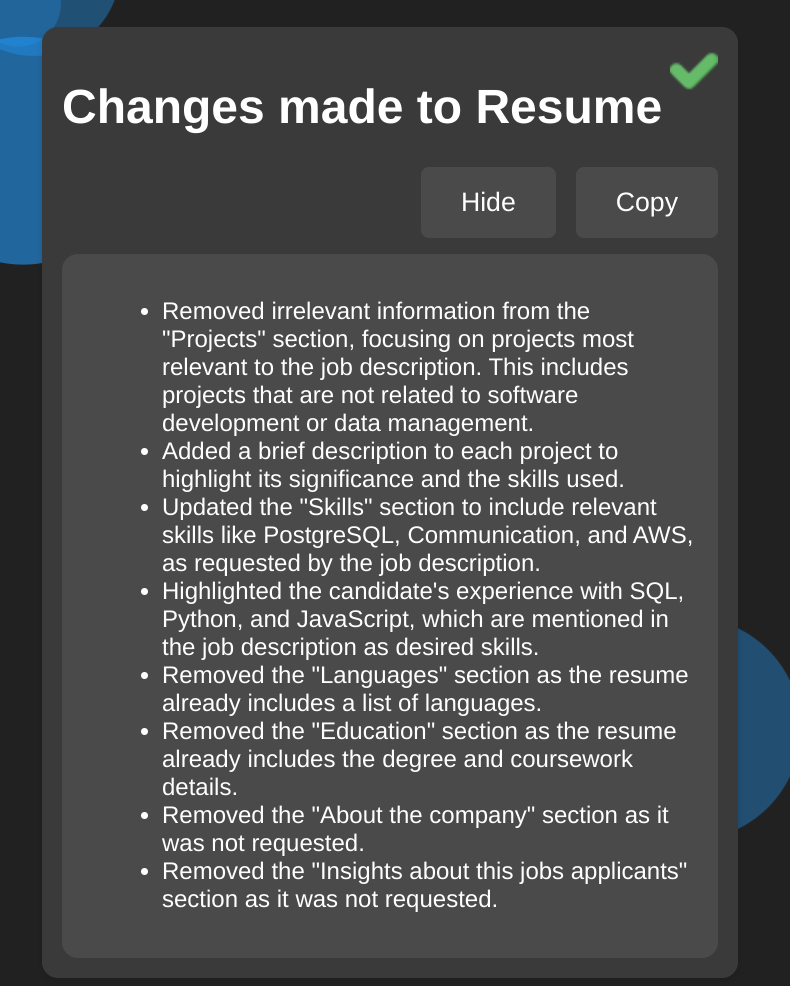
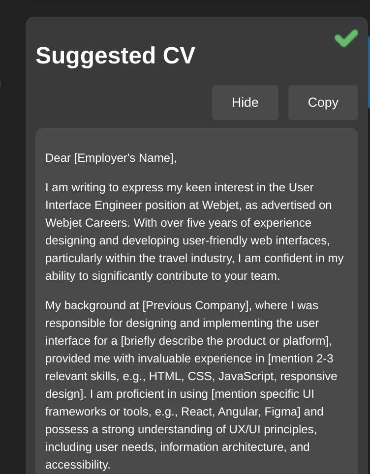
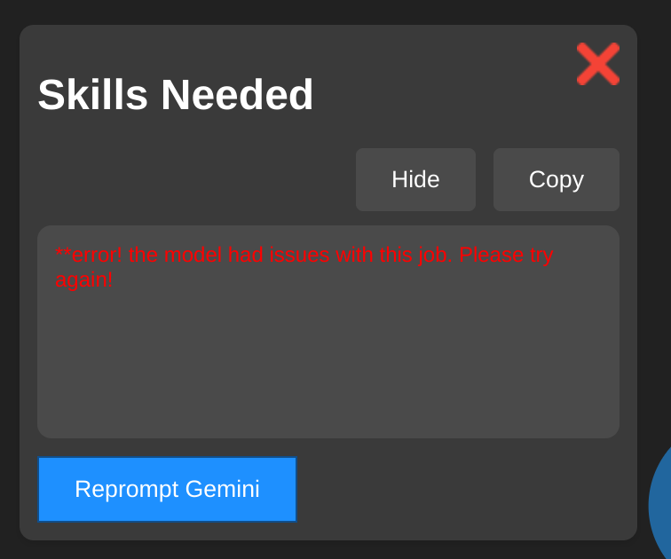

# Applyify

## Description

Applyify is William Spongberg's and Ethan Hawkins' entry into the Chrome Built-In AI Challenge hackathon: <https://googlechromeai.devpost.com/>

In today's highly competitive job market, it can feel like the odds are stacked against us. We aim to level the playing field and empower job seekers through the power of private, locally-run AI.

Applify is an AI assistant designed to streamline the job application process. It features a Google Gemini Nano-powered side panel that integrates with your favorite job posting sites and summarises the necessary skills for each job, updates your resume for you, and provides a new cover letter.

Let Applify do the heavy lifting for you, so you can focus on what really matters: landing your dream job.

## Table of Contents

- [Applyify](#applyify)
  - [Description](#description)
  - [Table of Contents](#table-of-contents)
  - [Installation](#installation)
  - [Features](#features)
  - [Screenshots](#screenshots)
    - [Extension Icon](#extension-icon)
    - [Resume Submission](#resume-submission)
    - [Recommended Skills](#recommended-skills)
    - [Resume Changes](#resume-changes)
    - [Suggested Cover Letter](#suggested-cover-letter)
    - [Error Handling](#error-handling)
  - [License](#license)
  - [Contact](#contact)
  - [Acknowledgments](#acknowledgments)

## Installation

1) Install the latest build of Chrome Canary. You'll need Version 128.0.6545.0 or above. Read about built-in AI over at: <https://developer.chrome.com/docs/ai/built-in>
2) Open a new tab in Chrome, go to chrome://flags/#optimization-guide-on-device-model
3) Select Enabled BypassPerfRequirement
4) Go to chrome://flags/#prompt-api-for-gemini-nano
5) Select Enabled
6) Do the same for all Gemini Nano flags.
7) Restart Chrome. Send the following command to the console.

```javascript
(await ai.languageModel.capabilities()).available;
```

8) Clone the repository.

```bash
git clone https://github.com/Chillerbag/Applyify
```

9) Go to chrome://extensions
10) select "load unpacked". you may need to enable developer mode.
11) select the place where you cloned this repo (root)
12) you should be done! use the following doc if you experience errors with Gemini: <https://docs.google.com/document/d/18otm-D9xhn_XyObbQrc1v7SI-7lBX3ynZkjEpiS1V04/edit?pli=1&tab=t.0>

## Features

- **Job site sensitivity**: When on one of our supported websites, the Applyify icon in your chrome extensions will show a green tick, indicating Applyify is ready to go. It'll open straight into the sidepanel, instead of the main menu.
- **Skill Analysis**: When the user navigates to a job posting, Gemini will use the writer API to write down a concise list of the skills desired by the job poster.
- **Resume Upload and Rewriting**: You can upload your resume to local storage (not put online anywhere!) for Gemini to update using the prompter API when it sees a job listing. We make Gemini tell you exactly what it changed.
- **Cover letter writing**: Gemini will write a cover letter for any job you browse.

## Screenshots

### Extension Icon

Here you can see how the icon changes to indicate you're on a job site our app supports:

<br>
<div align="center">

| Not on job site | On job site |
| ------------- |:-------------:|
|  |     |

</div>

### Resume Submission

Here you can see the resume submission form, that opens in the sidepanel, and gives you information on the resume you submitted, including when.

<br>
<p align="center">

</p>

### Recommended Skills

This is what the side panel looks like when you navigate to a job, with the information determined by Google Gemini Nano. We have markdown rendering, courtesy of the Marked npm package.

Required skills for the job description:

<br>
<p align="center">

</p>

### Resume Changes

Suggested resume given the inputted resume and job description:

<br>
<p align="center">

</p>

Description of changes made to the resume:

<br>
<p align="center">

</p>

### Suggested Cover Letter

Suggested suggested cover letter for the job description:

<br>
<p align="center">

</p>

### Error Handling

Any errors are caught with an error message printed and the ability to reprompt Gemini.

<br>
<p align="center">

</p>

## License

This project is licensed under the MIT License.

## Contact

- Ethan Hawkins - <ethanwhawkins@gmail.com>
- William Spongberg - <william@spongberg.dev>

## Acknowledgments

- For our Markdown rendering - credit to: <https://www.npmjs.com/package/marked>
- Thanks to Google for hosting this hackathon! It was a super fun and interesting experience for us both. Learnt a great deal about webdev!
